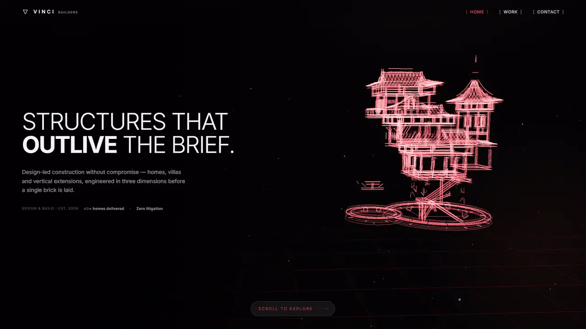
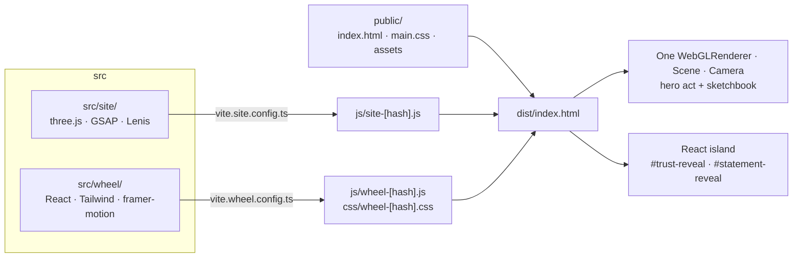

<div align="center">

# VINCI - Interactive 3D Web Experience

**A scroll-driven 3D landing page for a construction practice: a wireframe house in WebGL, a page-turning sketchbook, and a React photo wall.**

</div>

<p align="center">Desktop only - open on a laptop (WebGL, 1024px+)</p>

<p align="center"><b>Live demo: <a href="https://vinci-interactive-landing-page.pages.dev">vinci-interactive-landing-page.pages.dev</a></b></p>

<p align="center">
  
</p>
<p align="center"><sub><a href="public/assets/video/preview.mp4">Watch the full-HD version (MP4)</a></sub></p>

---

A single-page, desktop-targeted site for a fictional construction
practice. Five sections, one shared WebGL stage, and a React island for the two
photo components. `public/` is the source; `npm run build` turns it into `dist/`.

## Quick start

```bash
npm install
npm run dev
```

Then open <http://localhost:5173>.

`npm run dev` builds into `dist/` and then serves it. Neither the bundles nor
`dist/` are committed, so the build has to run before the page will boot.

| Script | What it does |
| --- | --- |
| `npm run build` | Copies `public/` to `dist/` and adds both content-hashed bundles. Deploys run this |
| `npm run dev` | Build, then serve `dist/` on port 5173 |
| `npm run serve` | Serve `dist/` without rebuilding |
| `npm run lint` | ESLint over `src/`, `scripts/` and `tests/` |
| `npm run format` / `format:check` | Prettier |
| `npm run typecheck` | `tsc` over the React island and, via `checkJs`, the vanilla site |
| `npm test` | Vitest unit tests in `tests/` |

CI (`.github/workflows/ci.yml`) runs lint, format check, typecheck, tests and the
build on every push and pull request.

## How it is put together



```
src/
  site/                     the vanilla three.js / GSAP site
    main.js                 boot sequence + all scroll choreography
    core/
      gate.js               desktop-only guard
      scroll.js             Lenis ↔ ScrollTrigger + scroll velocity
      stage.js              the single shared renderer / scene / camera
      cursor.js             custom cursor
    scenes/
      model-wire.js         loads the baked wireframe buffers
      hero-model.js         the hero's glowing line-segment house
    transitions/
      velocity-warp.js      global scroll-velocity distortion shader
    ui/
      sketchbook.js         the page-turning 3D book (canvas + CSS 3D)
      reveal.js             scroll reveals, split-text headlines, hero intro
      form.js               enquiry validation + delivery
  wheel/                    React island — Tailwind + framer-motion
    main.tsx                mounts both components into the vanilla page
    components/ui/
      scattered-polaroids.tsx   Trust: flippable photo cluster
      reveal-slider.tsx         Statement: drag-to-wipe drawing/photo
      photo-chrome.tsx          shared grain / bracket / lightbox chrome
scripts/
  build.mjs                 public/ + both bundles → dist/, hashed names injected
  build-model-wire.mjs      GLB → quantised feature-edge buffers (run by hand)
  serve.mjs                 zero-dependency static server for dist/
tests/                      Vitest unit tests
public/                     ← source of the deployable site
  index.html                all section markup
  css/main.css              design tokens and layout (hand-written)
  _headers                  Cloudflare cache and security headers
  assets/model/             baked hero wireframe (house-wire.bin/.json)
  assets/house/             project photography
  assets/sketchbook/        the book's page images
  assets/video/             looping preview shown on phones
```

### Two bundles, one page

The page is vanilla three.js and GSAP with a small React island grafted into two
`<div>`s. They share nothing at runtime — no React on the vanilla side, no
three.js on the island side — and are built by two separate Vite configs
(`vite.site.config.ts`, `vite.wheel.config.ts`) that both emit into `dist/`.

Bundle filenames carry a content hash, and `scripts/build.mjs` rewrites
`index.html` to point at them. A new build means new URLs, so `_headers` can
cache JavaScript as `immutable` without ever serving a stale bundle.

Rollup sees the whole graph for each, so three ships tree-shaken and minified
(~660 KB, 190 KB gzipped) rather than as the 1.3 MB unminified dev build the
site used to self-host under `public/vendor/`.

### One stage, many acts

There is exactly **one** `WebGLRenderer`, one `Scene` and one
`PerspectiveCamera` for the whole page (`core/stage.js`). Each 3D act registers
a `THREE.Group` and is switched on and off by scroll range. Because the camera
is shared, an act can hand it to the next one and the move reads as a
continuous flight rather than a cut.

In practice only the hero act uses the stage today: it holds the camera from
the top of the page through the sketchbook's arrival, then turns away and fades
out along with the canvas. Trust, Statement and Contact are flat DOM sections
with no 3D backdrop.

### The hero wireframe

The source is [Make your own steampunk house](https://sketchfab.com/3d-models/make-your-own-steampunk-house-0bceb4f2d7444809b022ba864ac03df3)
by [Conrad Justin](https://sketchfab.com/ConradJustin), a 116 MB Sketchfab presentation board, almost all of it PBR
textures the blueprint never samples, so it is never loaded in the browser.
`scripts/build-model-wire.mjs` extracts feature edges once — boundary edges plus
creases past 32° — and writes a quantised binary of a few hundred KB, with each
edge tagged by construction phase. Re-run it by hand only if the source model
changes:

```bash
node scripts/build-model-wire.mjs path/to/model.glb
```

## The enquiry form

`src/site/ui/form.js` validates fully and delivers via whatever endpoint is set
on the form in markup:

```html
<form id="enquiry-form" data-endpoint="https://formspree.io/f/XXXXXXXX">
```

Any form-to-email service that accepts a JSON `POST` works unchanged — Formspree
and Web3Forms (add its `access_key` as a hidden input) both do.

**With `data-endpoint` empty the form does not claim to have sent anything.** It
opens the visitor's mail client with the brief pre-filled and says so, rather
than showing a thank-you for an enquiry that went nowhere. Netlify Forms is the
one option that needs markup changes instead: it wants a urlencoded POST to the
page's own path plus a hidden `form-name` input.

## Content that is placeholder

Written to be plausible for a design-build practice, but none of it is real:

- All body copy and section narrative
- Studio address, phone and email in `index.html`
- "Est. 2009" and "40+ homes delivered"
- Every photograph — none of these are VINCI projects (see [CREDITS.md](CREDITS.md))

## Deploying

Deploys run on **Cloudflare Pages**:

| Setting | Value |
| --- | --- |
| Build command | `npm run build` |
| Output directory | `dist` |
| Node version | pinned to 22 by `.nvmrc` |

Headers live in `public/_headers` and are copied into `dist/` with everything
else.

`public/assets/` is committed on purpose. The host clones the repo and then
builds, and nothing in the build generates photographs or the baked model
geometry, so an uncommitted asset is a 404 in production, not a build error.

## Browser support

Desktop Chromium, Firefox and Safari with WebGL. Below 1024px, on coarse
pointers, or without WebGL, `core/gate.js` replaces the page with a notice —
this was a deliberate scope decision, not an oversight.

`prefers-reduced-motion` is honoured: Lenis's smooth scrolling is handed back to
the browser, the preloader's minimum duration collapses, decorative animation
stops, and `[data-reveal]` elements start visible instead of waiting on an
animation that will not run. The scroll choreography itself remains.

On phones the notice plays a short looping preview of the site
(`public/assets/video/preview.mp4`, 1920×1080, about 8 MB). It is only fetched when the
notice is shown.

## Performance

Lighthouse 12, desktop preset, against the live site (October 2026):

| Performance | Accessibility | Best practices | SEO |
| --- | --- | --- | --- |
| 61 | 96 | 100 | 92 |

LCP 2.9 s, TBT 160 ms, CLS 0.28. The score is held back mainly by the size of
the JavaScript bundle and by layout shift. Details and bundle sizes are in
[docs/PERFORMANCE.md](docs/PERFORMANCE.md).

## Known limits and next steps

- **Desktop only.** Phones get a preview video, not the site. A reduced mobile
  version (no WebGL hero, static sketchbook) is the obvious next step.
- **Layout shift.** CLS is above the 0.1 target. The preloader and font swap
  are the likely causes; this has not been profiled yet.
- **Bundle size.** The site bundle (three.js, GSAP, Lenis and site code) is
  ~190 KB gzipped. Code-splitting the hero from
  the rest would let the first paint happen sooner.
- **Test coverage.** Unit tests cover the form rules and the wireframe loader.
  The scroll choreography is verified by hand, not by tests.


## Design documentation

- [docs/DECISIONS.md](docs/DECISIONS.md): the main technical decisions, why
  each was made, and the trade-offs.
- [docs/PERFORMANCE.md](docs/PERFORMANCE.md): Lighthouse results, bundle sizes
  and what to optimise next.
- [CHANGELOG.md](CHANGELOG.md): what changed in each release.

Every hand-built visual piece — the hero wireframe, the sketchbook, the lamp
glow, the cursor, the wheel's photo components, and so on — is written up
individually, properties and all, in [`docs/DESIGN.md`](docs/DESIGN.md).

## Credits

- 3D model: [Make your own steampunk house](https://sketchfab.com/3d-models/make-your-own-steampunk-house-0bceb4f2d7444809b022ba864ac03df3)
  by [Conrad Justin](https://sketchfab.com/ConradJustin), used under the
  [Sketchfab Standard licence](https://sketchfab.com/licenses). The repo ships
  only its extracted feature edges, not the original model.
- Photographs: placeholder images collected from Pinterest; the original
  creators could not be identified, and copyright remains with them.
- Fonts: Inter, Instrument Serif and Newsreader, via Google Fonts (SIL Open
  Font License).

Full details are in [CREDITS.md](CREDITS.md).

## License

MIT © 2026 Nishanth S. See [LICENSE](LICENSE).

The MIT licence covers the code only. The photographs, the 3D model and the
fonts belong to their respective owners; see [CREDITS.md](CREDITS.md).
